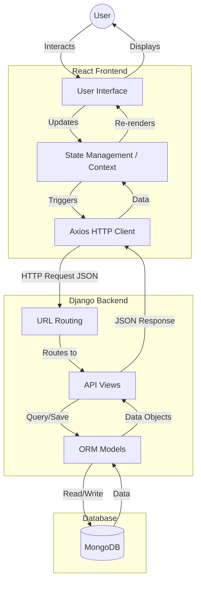

# SJG Project

A full-stack e-commerce web application built with React and Django.

## 🚀 Tech Stack

### Frontend
- **Framework:** React 19
- **Routing:** React Router DOM v6
- **HTTP Client:** Axios
- **UI/Icons:** FontAwesome
- **File Upload:** React Dropzone
- **Styling:** CSS (Custom)

### Backend
- **Framework:** Django 3.2
- **API:** Django REST Framework 3.14
- **Database Connector:** Djongo 1.3.6 (MongoDB Support)
- **CORS:** django-cors-headers

## 📁 Project Structure

```
SJG-/
├── backend/            # Django Backend
│   ├── api/            # App containing API views/models
│   ├── backend_project/# Project settings
│   ├── manage.py       # Django CLI entry point
│   └── requirements.txt
├── frontend/           # React Frontend
│   ├── public/         # Static assets
│   ├── src/            # Source code (Components, Pages)
│   ├── package.json
│   └── .env
├── run_dev.bat         # Windows script to start both servers
└── run_dev.sh          # Linux/Mac script to start both servers
```

## 🛠️ Prerequisites

Ensure you have the following installed:
- **Python** (3.8+)
- **Node.js** (16+) & **npm**
- **MongoDB** (Local or Atlas connection)

## 📦 Installation

### 1. Backend Setup
Navigate to the backend directory and install dependencies:
```bash
cd backend
pip install -r requirements.txt
```
*Note: Ensure you have a virtual environment active if preferred.*

### 2. Frontend Setup
Navigate to the frontend directory and install dependencies:
```bash
cd frontend
npm install
```

## ▶️ Running the Application

### Option A: One-Click Script (Windows)
Double-click `run_dev.bat` or run it from the command line:
```cmd
.\run_dev.bat
```
This script starts both the backend (on port 8000) and frontend (on port 3000) binding to `0.0.0.0`, making it accessible on your local network.

### Option B: Manual Startup

**Terminal 1 (Backend):**
```bash
cd backend
python manage.py runserver 0.0.0.0:8000
```

**Terminal 2 (Frontend):**
```bash
cd frontend
# Windows
set HOST=0.0.0.0 && npm start
# Linux/Mac
HOST=0.0.0.0 npm start
```

## 🌐 Accessing the App

- **Frontend:** `http://localhost:3000` (or your local IP)
- **Backend API:** `http://localhost:8000`

## ✨ Key Features
- **User Authentication:** Login and Sign-up functionality.
- **Admin Dashboard:** Order management and product controls.
- **Product Catalog:** Browse and view products.
- **Shopping Interface:** Checkout and cart management.

## 📝 Notes
- The frontend is configured to proxy API requests to `http://127.0.0.1:8000` to avoid CORS issues during development.

## 🧩 Module Descriptions

### Backend (`/backend/api`)
The backend is built with Django and serves as the REST API provider.
- **Models (`models.py`)**: Defines the data structure.
  - `Product`: Stores product details (name, description, price, image URL).
  - `Order`: Tracks customer orders, including items list, total amount, status, and user association.
- **Views (`views.py`)**: Handles the business logic for incoming requests.
  - Authentication (Login, Register).
  - Product listing and retrieval.
  - Order processing and management.
- **Serializers (`serializers.py`)**: Converts complex querysets and model instances into native Python datatypes (JSON) for API responses.

### Frontend (`/frontend/src`)
The frontend is a single-page application (SPA) built with React.
- **Pages (`/pages`)**:
  - **Public**: `Home`, `About`, `Contact`, `Services`, `Products` (Catalog).
  - **Auth**: `Login`, `Register`.
  - **Shopping**: `Cart`, `Checkout`, `OrderConfirmation`.
  - **Admin**: `OrderManagement`, Dashboard tools (located in `/pages/admin`).
- **Components (`/components`)**: Reusable UI elements like Navigation, Footers, and Product Cards.
- **Context (`/context`)**: Global state management for:
  - `AuthContext`: Manages user login state.
  - `CartContext`: Manages shopping cart items across pages.

## 🔄 Data Flow Diagram

The application follows a standard Client-Server architecture.



1.  **Interaction**: User performs an action (e.g., "Add to Cart").
2.  **State Update**: React Context updates local state immediately.
3.  **API Call**: For persistent actions (e.g., "Checkout"), Axios sends a POST request to the Django API.
4.  **Processing**: Django receives the request, validates data via Serializers, and processes logic in Views.
5.  **Storage**: Data is saved to MongoDB via Djongo ORM.
6.  **Response**: Success/Failure status is returned to the Frontend to notify the user.

